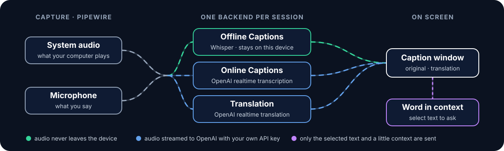
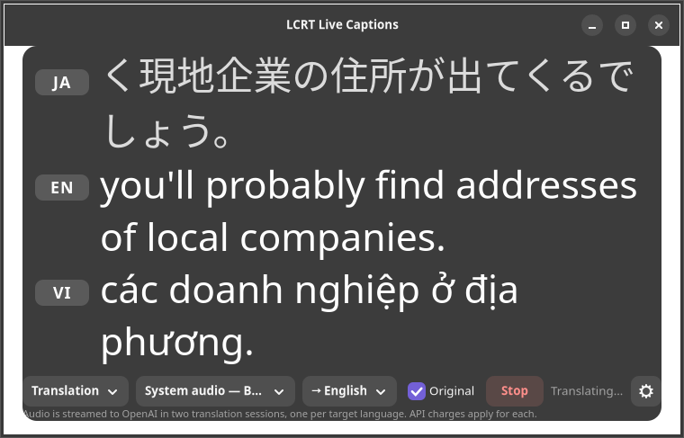
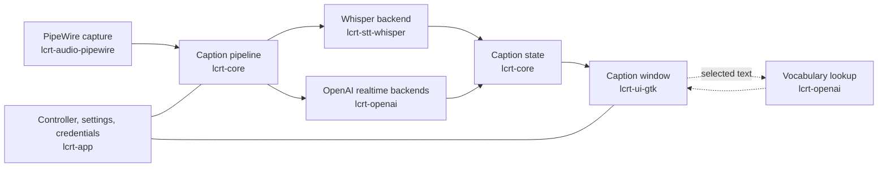

<div align="center">



<br>

# LILOPOP

**Translate and caption, live — no connection needed**

[](https://github.com/XKeviNguyen/lcrt/actions/workflows/ci.yml)


**[Install](#-install-on-ubuntu)** ·
**[Use](#-use)** ·
**[Modes](#-four-modes-one-window)** ·
**[Measured](#-measured-not-promised)** ·
**[Privacy](#-privacy-at-a-glance)** ·
**[How it works](#-how-it-works)** ·
**[Develop](#-development)**

</div>

---

LILOPOP is a native desktop app for live captions and real-time translation. It
captions whatever your computer is playing, or your microphone, in a small
window that stays out of the way.

<table>
<tr>
<td width="33%" valign="top">

### 🎧 Hear it, read it

Captions for **system audio** (videos, calls, lectures) or your
**microphone**, updated as the words are spoken.

</td>
<td width="33%" valign="top">

### 🌏 Across languages

Real-time **translation** into one or two languages at once, each in its
own labeled lane, with the original speech above them when you want it.

</td>
<td width="33%" valign="top">

### 📖 Learn as you go

**Select a word** in the captions to see its meaning, reading and how it is
used in that sentence.

</td>
</tr>
<tr>
<td valign="top">

### 🔒 Private by default

**Offline Captions** work right after installing, in eight languages, with
the speech model that comes with LILOPOP. Audio never leaves the device, and
LILOPOP has no telemetry.

</td>
<td valign="top">

### 🔑 Your own key

Online features use **your** OpenAI API key, stored in the desktop keyring
and never in a file or log.

</td>
<td valign="top">

### 🎨 Make it yours

Font, size, colors, transparency and window size are adjustable and
remembered.

</td>
</tr>
</table>

Primary platform: **Ubuntu AMD64** (PipeWire, GTK4, libadwaita, Wayland or
X11). Ubuntu ARM64 and Windows 10/11 are portability targets.

## 🧭 Four modes, one window

<div align="center">

</div>

| Mode | Engine | Languages | Needs |
| --- | --- | --- | --- |
| Offline Captions | Bundled Whisper Tiny multilingual (Fast) | Auto, EN, JA, VI, ZH, KO, ES, FR, DE | Nothing after installation |
| Offline Translation | Whisper Tiny + local CTranslate2 / OPUS-MT int8 | Japanese↔English and Vietnamese↔English | Explicit spoken language and a supported target; no API key or internet |
| Online Captions | OpenAI realtime transcription | The same eight languages, or Auto | Your OpenAI key and internet |
| Online Translation | OpenAI realtime translation | One or two targets from the eight languages | Your OpenAI key and internet; charged per target |

Offline translation shows the source immediately and translates the current
speech window in a separate CPU worker. It never downloads at runtime or silently
falls back online. Japanese↔Vietnamese pivot is not included.

Each session uses exactly one backend. LILOPOP never switches to another backend
or to a paid service on its own.

Measured results for the new offline path are in [the focused acceptance report](docs/SHIP_FAST_ACCEPTANCE.md).

### Multi-language lanes

<div align="center">

<br>
<sub>A PR #30 session before the LILOPOP rebrand. The speech is a FLEURS test utterance (CC BY 4.0).</sub>
</div>

In either translation mode the caption area becomes a stack of lanes. Each lane has a
language badge on the left and its own selectable text:

1. the **original speech**;
2. the **first translation**;
3. an optional **second translation**.

The order never changes, and there are at most three lanes: the original and
two translations. In Online Translation, Japanese speech can be shown with English and
Vietnamese below it.

Next to Start, a **language chip** stands for each lane, such as
`JA EN VI +`. They work while captions run, without Stop and Start:

| Do this | And this happens |
| --- | --- |
| Click a chip | Its lane is hidden or shown again. Hiding only changes what you see: the lane keeps translating, so showing it again is instant. A hidden lane's chip stays, dimmed. At least one lane always stays visible. |
| Open a chip's menu (its arrow) | **Pause translation** closes that language's session, so it stops costing anything, and keeps its text; **Resume translation** opens it again from the live audio. **Remove language** drops the lane. The other lanes keep running. |
| Click **+** | Lists the languages you can add. The new lane shows **Connecting…** and then translates from the live audio. The other lanes are not restarted. With two translation languages, + is disabled. |

While a session is still starting, the chips only show and hide lanes; the
other changes are available once captions have started. When every language
is paused, the notice under the controls says that no audio is being sent.

Changing mode or audio source restarts a session. In offline modes, changing the spoken language also restarts it.

- **Online: one session per target.** The translation service takes one output
  language per session, so a second target opens a second session and is
  charged separately. There are never more sessions than running targets.
- **Targets are kept valid.** Two targets can't be the same, and a target
  can't repeat a spoken language you named in Settings. There is always at
  least one target.
- **Online lanes fail independently.** If one target's session fails, LILOPOP says so
  and the other lane keeps translating. **Resume translation** in the failed
  lane's menu tries again.
- **In online modes, words in context work in every lane.** Select text in any lane to have it
  explained from that lane's own text.
- **Lanes fit the window you chose.** The lanes share the window's height and
  never enlarge it. A lane with room for two lines wraps its text, as in the
  picture. With less room it shows one line that follows the newest words.
  Either way only whole lines are shown, unless a lane is shorter than one
  line at a very large font; its text is then cut off rather than the window
  grown.

## 📊 Measured, not promised

These numbers come from real runs through system audio on one Ubuntu 26.04
laptop, scored against reference transcripts. The method, test audio and
every result are in [docs/V2_ACCEPTANCE.md](docs/V2_ACCEPTANCE.md).

| Session | First caption | Error against the reference | Stop |
| --- | --- | --- | --- |
| Online Captions, English | 2.2 s | 6.1% of words | 1.4 s |
| Online Captions, Japanese | 3.1 s | 15.5% of characters | 1.4 s |
| Online Captions, Vietnamese | 2.1 s | 7.5% of words | 1.4 s |
| Translation, English → Japanese | 1.7 s | not scored | 6.5 s |
| Translation, Vietnamese → English | 2.0 s | original lane 7.7% of words | 7.1 s |
| PR #30 Offline Captions, English (base model) | 2.3 s | recovers 93% of words* | 0.9 s |
| PR #30 Offline Captions, Japanese (base model) | 3.5 s | recovers 79% of characters* | 0.9 s |
| PR #30 Offline Captions, Vietnamese (base model) | 2.3 s | recovers 71% of words* | 0.9 s |

- **Network drops:** after a 2 s cut in the middle of a session, captions
  were back 3.8 s later without an error.
- **Online Translation takes a few seconds to stop** because the service delivers
  the last words of the translation after you press Stop.
- **Offline Captions repeat phrases** on continuous speech, so their error
  rate isn't comparable with the online rows. *Their rows give the share of
  the reference the captions recover, in order. The repeats are the main
  known quality issue, listed with the other [limitations](#-limitations).
- **Offline on two CPUs:** limited to two logical CPUs and 2 GB of memory,
  Offline Captions kept up with speech in all three languages, and used
  under 500 MB.

## 📦 Install on Ubuntu

The Debian package is built for the Ubuntu release it is built on. It needs
`libgtk4-layer-shell0`, which Ubuntu packages from 24.10 onward. Ubuntu 26.04
LTS is the tested release.

```sh
scripts/build-deb.sh            # prints target/debian/lcrt_2.0.0_amd64.deb
sudo apt install ./target/debian/lcrt_2.0.0_amd64.deb
```

Then open **LILOPOP Live Captions** from the app grid, or run `lcrt`. Offline
Captions work at once, with no download and no setup.

The package includes Whisper Tiny multilingual (78 MB), four int8 OPUS-MT
models, and the local CTranslate2 runtime. No model setup is required.
Build-time downloads are pinned and verified with SHA-256; mismatches fail
packaging. See [speech model pins](packaging/models.json),
[translation model pins](packaging/translation-models.json), and
[runtime wheel pins](packaging/translation-runtime.json).

## 🚀 Use

1. **Choose a mode and an audio source.** System audio sources are listed as
   **System audio**, microphones as **Microphone**. Then choose the language:
   - Offline and Online Captions: the spoken language, or **Auto** to have it
     detected. Captions are always in the spoken language; they are never
     translated.
   - Offline Translation: choose Japanese, English, or Vietnamese as the spoken
     language, then a supported target with the language chips.
   - Online Translation: the language chips (see
     [Multi-language lanes](#multi-language-lanes)). The spoken language is
     detected automatically.
2. **Press Start.** Captions update as speech is recognized. **Stop** finishes
   the last sentence and keeps the text on screen.
3. **In online modes, select a word or phrase** in the captions to see what it means in that
   sentence.
4. **Open Settings** to enter your OpenAI API key and adjust appearance and
   vocabulary.

LILOPOP remembers the last mode, source, languages and which lanes you hid.

<details>
<summary><b>Offline model</b>: built in, with an optional custom one</summary>

<br>

Offline Captions use the model installed with LILOPOP: Whisper Tiny
multilingual (Fast), at `/usr/share/lcrt/models/ggml-tiny.bin`. Settings shows it as
**Offline model: Built-in multilingual model**; there is nothing to choose.

Under **Settings → General → Advanced**, **Use a custom Whisper model** lets
you pick another whisper.cpp model file instead. It is never required.
Language support then depends on that model: an English-only model (such as
`ggml-base.en.bin`) is refused for any spoken language other than English or
Auto, rather than inventing English text for other speech.

</details>

<details>
<summary><b>OpenAI API key</b>: how it is stored</summary>

<br>

Enter the key in **Settings → Online** and choose **Save securely** to store
it in the desktop keyring (GNOME Keyring or another Secret Service provider).
**Test connection** checks the key.

- If no keyring is available, the key is kept only until LILOPOP quits.
- As a fallback, LILOPOP reads `OPENAI_API_KEY` from its environment and never
  displays it.
- The key is never written to a file or log.

</details>

<details>
<summary><b>Window behavior</b>: staying on top</summary>

<br>

On Wayland compositors that support layer-shell protocol v4 or newer, the
caption window is pinned near the bottom of the screen above other windows.
GNOME Wayland, X11 and older compositors use a standard window: transparency
still works, but LILOPOP cannot keep it on top.

</details>

## 🔒 Privacy at a glance

| What you do | What leaves your computer |
| --- | --- |
| Offline Captions | Nothing. LILOPOP opens no network connection in this mode. |
| Online Captions | Audio from the selected source, only while speech is detected, plus the language hint. |
| Offline Translation | Nothing. Speech and translation run on this device. |
| Online Translation | All audio from the selected source while the session runs, plus the target language. With two targets, the same audio goes to two sessions, one per target. |
| Select text, with Vocabulary on | The selection (at most 200 characters) and up to 160 characters of caption on each side. |
| Select text, with Vocabulary off | Nothing. |
| Test connection | One request that lists models. No audio or text. |

LILOPOP has no telemetry, analytics or crash reporting, and it saves neither
audio nor transcripts to disk. Everything it sends goes from your computer
directly to OpenAI. [docs/PRIVACY.md](docs/PRIVACY.md) has the full details.

## 🧠 How it works



| Crate | What it holds |
| --- | --- |
| `lcrt-core` | The portable domain: audio chunks, the caption pipeline, caption state, sessions and preferences. No OS-specific code. |
| `lcrt-audio-pipewire` | PipeWire capture for microphones and system-output monitors. |
| `lcrt-stt-whisper` | Local speech-to-text through whisper.cpp, with a bounded rolling window. |
| `lcrt-openai` | Realtime transcription and translation over WebSocket, vocabulary lookups, and keyring-backed credentials. |
| `lcrt-ui-gtk` | The GTK4 and libadwaita caption window, Settings and the vocabulary popover. |
| `lcrt-app` | The `lcrt` binary: the controller that owns sessions, settings and credentials. |

A few rules shape the design:

- **One backend per session.** Starting a new session replaces the running
  one only after it has fully stopped.
- **Bounded everywhere.** Audio queues, caption history and reconnects all
  have limits. When the network falls behind, LILOPOP skips stale audio to stay
  with live speech.
- **The window never waits.** Network, keyring and file work happen off the
  GTK thread.
- **Late events can't leak.** Every session has a generation, and updates
  from a replaced session are dropped.

The portable core and its adapter boundaries are described in
[docs/architecture.md](docs/architecture.md).

## 🚧 Limitations

- **Offline Captions repeat overlapping phrases** on continuous speech. V1
  chose a visible repeat over silently losing words. A better fix is planned.
- Offline accuracy and speed depend on the CPU. The built-in Tiny model is
  small enough for modest hardware, so its Japanese and Vietnamese captions
  contain more mistakes than the online service's.
- **Offline Translation supports only Japanese↔English and Vietnamese↔English.**
  It translates the current speech window, not a saved transcript. Short or
  incomplete phrases may produce no translation until more speech arrives.
  Japanese↔Vietnamese pivot is not included. A local worker error ends the
  session with a clear message; Stop/Start retries it.
- Audio sources are discovered at launch.
- Online modes need a network connection. LILOPOP reconnects a few times after a
  brief drop, then reports the problem.
- Both translation modes show at most three lanes: the original and two targets. Each
  online target is a separate paid session.
- The original lane's badge shows `SRC` until you name the spoken language in
  Settings, because Online Translation detects the language without reporting it.
  For the same reason, a target that equals the spoken language can only be
  prevented once you have named it.
- Online Translation takes 5–8 s to stop, and up to about 14 s when the service is
  slow, because the service delivers the last words after you press Stop.
  Changing the mode or source during a session does not wait for them.
- Always-on-top needs a compositor with layer shell. GNOME does not provide
  it.

## 📍 Roadmap

| | Milestone | Status |
| --- | --- | --- |
| **V1** | Live captions from the microphone and system audio, offline | ✅ Done |
| **V2** | Online captions, real-time translation, vocabulary, secure key storage, appearance, Ubuntu package | ✅ Done |
| **V3** | Richer language help (grammar, examples), plus vocabulary history | 🔭 Planned |
| Later | Ubuntu ARM64 and Windows 10/11 | 🔭 Planned |

## 🔧 Development

The checked-in `rust-toolchain.toml` pins the primary development and CI
toolchain to Rust 1.98.0 with the `rustfmt` and `clippy` components. This is
separate from the workspace's declared minimum, Rust 1.88 (`rust-version` in
`Cargo.toml`), which is the first release with the let-chains the code uses.

Install the native development prerequisites (Ubuntu 24.04 or newer):

```sh
sudo apt install build-essential clang cmake libadwaita-1-dev libdbus-1-dev \
  libgtk-4-dev libpipewire-0.3-dev libspa-0.2-dev libwayland-dev meson \
  ninja-build pkg-config wayland-protocols
scripts/install-gtk4-layer-shell.sh
```

The layer-shell installer skips its checksum-verified source build when the
system already provides GTK4 layer shell 1.0.4 or newer.

Run the same local quality gates as CI with:

```sh
cargo fmt --all -- --check
cargo clippy --locked --workspace --all-targets --all-features -- -D warnings
cargo test --locked --workspace --all-features
RUSTDOCFLAGS="-D warnings" cargo doc --locked --workspace --all-features --no-deps
```

Fetch the built-in model once, then run from source. A build in `target/`
finds the model in `target/share/lcrt/models/`, where the script saves it:

```sh
scripts/fetch-models.py         # verifies the pinned SHA-256
cargo run -p lcrt-app --bin lcrt
```

`--model PATH` (or `LCRT_MODEL_PATH`) uses another model for one run.

<details>
<summary><b>Diagnostics</b>: source IDs and bounded runs</summary>

<br>

For source IDs, and a bounded diagnostic run that starts captions itself and
closes after the given time:

```sh
cargo run -p lcrt-app --bin lcrt -- --list-sources
cargo run -p lcrt-app --bin lcrt -- --smoke-source SOURCE_ID --smoke-seconds 10
```

`--smoke-mode online|translation` runs the same diagnostic against OpenAI and
uses the saved or `OPENAI_API_KEY` key. A diagnostic passes only if its
backend became ready and audio was captured. Closing the window cancels the
session without waiting on a blocked worker, so a stuck native call cannot
delay exit.

</details>

<details>
<summary><b>Linux audio</b>: the PipeWire capture utility</summary>

<br>

PipeWire capture development requires `libpipewire-0.3-dev`,
`libspa-0.2-dev`, and `pkg-config`. The bounded diagnostic utility enumerates
both microphone sources and system-output monitor targets:

```sh
cargo run -p lcrt-audio-pipewire --bin lcrt-pw-capture -- list
cargo run -p lcrt-audio-pipewire --bin lcrt-pw-capture -- capture <source-id> 3
```

The capture duration is clamped to 1–30 seconds. The utility reports the
negotiated format and aggregate sample statistics. It neither records audio
to disk nor silently substitutes synthetic audio when PipeWire fails.

</details>

<details>
<summary><b>Caption window</b>: the scripted demo</summary>

<br>

The Ubuntu window uses GTK4 and libadwaita. Install `libgtk-4-dev` and
`libadwaita-1-dev`, then launch its incremental-caption demonstration with:

```sh
cargo run -p lcrt-ui-gtk --bin lcrt-caption-ui
```

The demo drives the same window with scripted partial and final captions. Its
`--smoke-test` mode injects deterministic updates and closes itself. It does
not exercise audio capture or online services.

</details>

<details>
<summary><b>Local Whisper</b>: the file transcription utility</summary>

<br>

The speech-to-text adapter uses whisper.cpp through `whisper-rs`, runs model
inference on a dedicated worker, downsamples input to 16 kHz mono, and keeps
both its input queue and rolling audio window bounded. Models are deliberately
excluded from Git; `scripts/fetch-models.py` downloads the ones listed in
[packaging/models.json](packaging/models.json) and keeps a file only if its
SHA-256 matches.

Transcribe a signed 16-bit PCM or 32-bit float WAV file with the bounded
diagnostic utility:

```sh
cargo run -p lcrt-stt-whisper --bin lcrt-whisper-transcribe -- \
  target/share/lcrt/models/ggml-tiny.bin path/to/audio.wav ja
```

A missing or invalid model produces an actionable error in the window. In
Offline Captions mode, LILOPOP does not download models and sends no audio to any
remote service.

</details>

## 📄 License

[MIT](LICENSE). The package's copyright file lists the license of every
third-party crate it links.

<div align="center">
<sub>Built with Rust, GTK4 and PipeWire.</sub>
</div>
